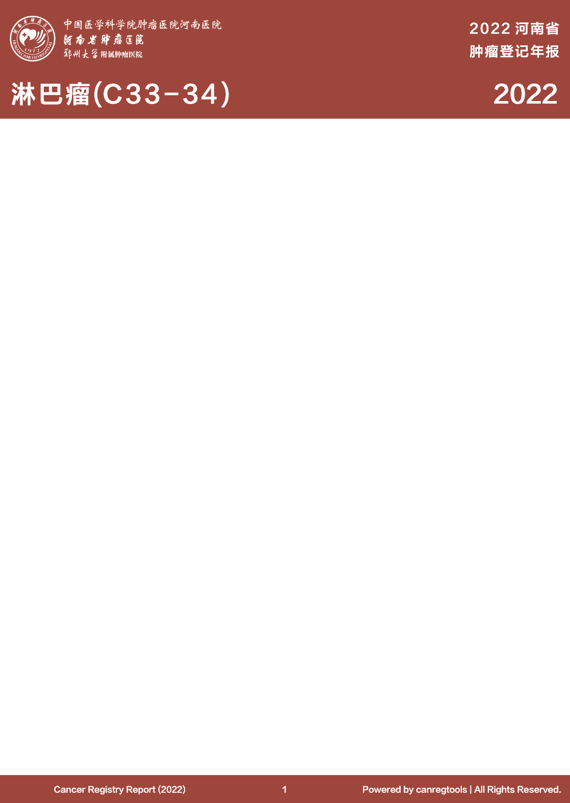

# Qcfact-Typst

`qcfact-typst` is a quarto typst format extension for creating a Cancer Fact Sheet inspired by the the Cancer Fact Sheet published by the Global Cancer Observatory.



## Installing

```bash
quarto use template gigu003/quarto-templates/qcfact
```

This will install the format extension and create an example qmd file
that you can use as a starting place for your document.


```bash
quarto install extension gigu003/quarto-templates/qcfact
```

This will install the clean format extension.

